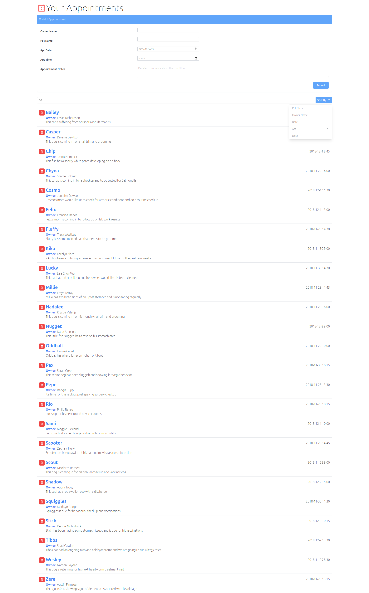

# Vetenary Scheduler

## Description
This is a React.JS SPA application created without using React Routes.  The useState, useEffect, and useCallback Hooks were used for state changes.  TailwindCSS and React Icons were used for styling.  No Vanilla CSS was used in this App. 

Search by owner name or pet name, and use the dropdown "Add Appointment" section to create a new entry which takes in the owner's name, pet's name, appointment date and time, and any appointment notes you may have. You also have the capability of sorting the information by pet name, owner name, date, ascending order, and/or descending order.  The sorting is done by clicking the "Sort by" button which (under the hood) triggers the .sort method that is attatched to the Array.map method. The client information is stored in the data.json file.  This file is accessed via an API fetch method. 

## Installation
Clone this repo to your local machine, cd into your new local repo, run `npm install` then `npm start`.  The Application will automatically open.  If the application doesn't automatically open, go to your browser and type `http://localhost:3000`.

## Contact Information

 

[https://www.williamlowrimore.com](https://williamlowrimore.com) 
[https://www.linkdin.com](https://www.linkedin.com/in/william-lowrimore-21778310) 
[https://www.github.com](https://www.github.com/wlowrimore) 
[wlowrimore@gmail.com](mailto:wlowrimore@gmail.com)
